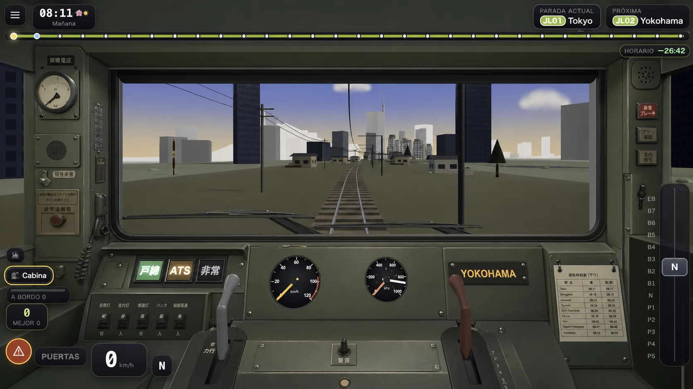
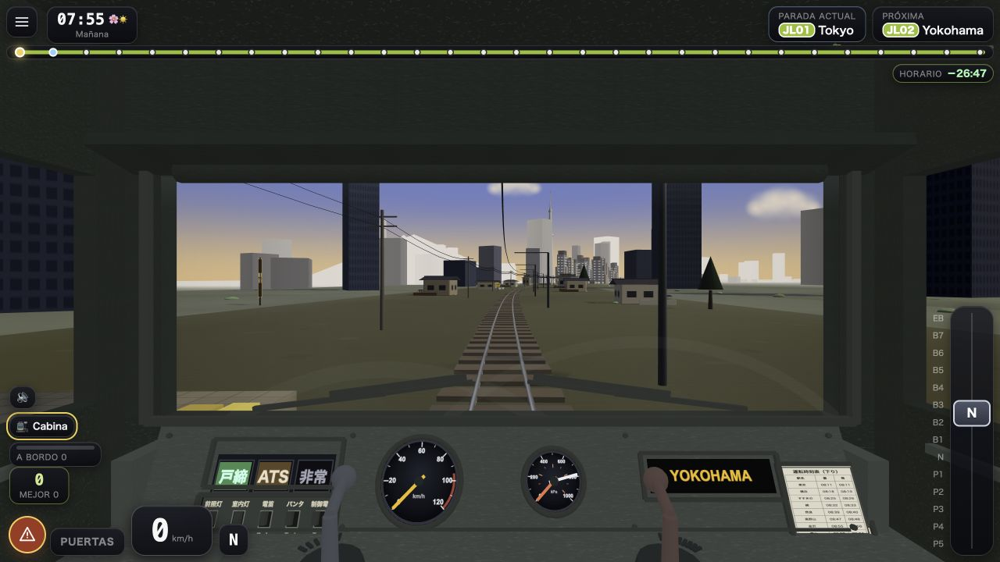

# Japan Loop 0.2.2 — pase gráfico de cabina

Fecha: 2026-07-31.

La tanda interna `0.2.1.2`, publicada como la versión semver válida `0.2.2`,
continúa el salto visual de 0.2.1 en el lugar que el jugador ve
durante casi toda la vuelta: la cabina. No cambia la posición del conductor,
la cámara, el tren exterior ni la luna panorámica. Convierte la cabina ya
correcta a escala en un espacio que se lee como **fabricado y operativo**,
manteniendo un coste explícito para móvil.

## 1. Problema visual

La cabina anterior ya resolvía la arquitectura: habitación completa, luna
compartida con el morro exterior, dos manetas ferroviariamente coherentes,
instrumentos funcionales y sombreado unlit. Sin embargo, desde la vista
principal todavía se percibía como un gran bloque gris:

- instrumentos y pantallas parecían pegados sobre una sola plancha;
- el barrido dibujado en el cristal no tenía limpiaparabrisas físicos;
- el supuesto soporte de documentos no mostraba ningún documento;
- los laterales eran superficies vacías al girar la cabeza;
- faltaban juntas, sellos, biseles, tornillería y rotulación que explicasen
  cómo estaba ensamblado el pupitre.

La solución no ha sido subir el pupitre, cerrar la ventana ni añadir
postprocesado. Se ha añadido jerarquía de piezas dentro de la geometría y el
encuadre existentes.

## 2. Referencia visual

La referencia se generó sobre una captura real del juego y sirve como objetivo,
no como textura ni asset. El prompt exigía conservar cámara, FOV, HUD, mundo,
ventana panorámica y disposición mascon/freno; pedía una cabina japonesa de
finales de los ochenta, low-poly premium y realizable con cajas, cilindros,
planos, geometría fusionada y texturas Canvas. Prohibía centro de luna,
pantallas futuristas, materiales de lujo, personajes y cambios al exterior.

La implementación no copia el detalle imposible de la referencia: traduce su
tesis —paneles fabricados y equipamiento funcional— al lenguaje del juego.

## 3. Qué se construyó

Ficheros principales:

- `src/game/CabInterior.ts`
- `src/game/signage.ts`
- `src/game/cab0212Contract.ts`

### Una malla de acentos

Se fusionan en **un solo draw**:

- junta de goma perimetral de la luna, sin pilar central;
- dos limpiaparabrisas físicos aparcados en el borde inferior;
- marcos elevados de testigos, destino, interruptores y horario;
- biseles reales alrededor de velocímetro y BC/MR;
- junta de servicio del panel, tornillería y labio frontal;
- cinco interruptores físicos sobre sus etiquetas.

El barrido antiguo del cristal no se elimina: ahora es la huella que dejan
estos wipers, no un efecto sin causa.

### Tres superficies informativas pequeñas

Las letras diminutas no se modelan en 3D. Tres CanvasTexture estáticas hacen el
trabajo que se resolvería mal con cientos de triángulos:

1. banco de interruptores (`前照灯`, `室内灯`, `電笛`, `パンタ`,
   `制御電源`);
2. `運転時刻表（下り）` con una tabla compacta del recorrido;
3. panel lateral con tensión de catenaria, altavoz, `信号炎管` y
   `非常通報`.

Los dos paneles laterales comparten **una sola geometría fusionada, un
material y una textura**, por lo que mirar a izquierda o derecha no duplica el
draw.

## 4. Contratos que no se tocaron

- Todas las cotas estructurales siguen derivando de `TrainConsist.ts`:
  `WINDSCREEN`, `CAB_SIDE_WINDOW`, `HALF_W`, `FLOOR_Y`, `ROOF_Y` y
  `WALL_T`.
- No cambian el ojo del conductor, FOV, cámara, cara exterior del tren ni
  anchura de la luna.
- La cabina continúa completamente **unlit**, con `bakeShading` y cero luces.
- `windscreenNdc()` conserva las mismas cuatro esquinas y sigue recortando
  lluvia/nieve al cristal.
- `戸締` se enciende con puertas cerradas; BC sube al frenar; MR conserva su
  ciclo; `非常` solo se ilumina en EB; los testigos siguen aditivos.
- Las texturas nuevas se dibujan una vez al construir. No se redibuja ninguna
  por frame ni se añade una asignación al `update()`.
- La cabina completa hereda `userData.dynamic`: los hashes del mundo estático
  no deben cambiar.

## 5. Presupuesto real

`measureCab0212()` recorre el grupo ya construido y publica en desarrollo
`<html data-cab0212>`. No cuenta una maqueta teórica.

| concepto | resultado | límite |
|---|---:|---:|
| draws | 20 | 20 |
| triángulos | 2.992 | 3.500 |
| texturas únicas | 10 | 10 |
| luces | 0 | 0 |
| materiales lit | 0 | 0 |

El cierre de la cabina anterior registraba 16 mallas / 1.552 triángulos. El
salto añade 4 draws y 1.440 triángulos en la vista de cabina; exterior y andén
siguen ocultando el grupo completo.

`enforceCab0212Budget()` lanza en desarrollo. En producción registra la
infracción y deja el juego vivo, igual que los presupuestos de la vertical
Susukino→Nishiki.

## 6. Verificación

- Día, vista frontal: juntas, wipers, interruptores y horario dentro del
  encuadre normal.
- Noche + invierno + ventisca: instrumentos legibles y cabina cálida sin que
  las superficies informativas se vuelvan blancas.
- Head-look a ambos lados: ventanilla compartida y panel de servicio con
  parallax real.
- Cámaras exterior y andén: la cabina no aparece ni añade coste.
- `?canon&checkWorld`: las cuatro referencias semánticas y estructurales de
  0.2.1 permanecen idénticas.
- Consola sin errores; solo continúa el aviso conocido de deprecación de
  `THREE.Clock`, fuera de este pase.
- El contrato puro cubre presupuesto, condición unlit, cero luces y el
  comportamiento dev/producción.

La prueba física de iPhone/Android y el offline tras matar la PWA continúan
siendo puertas distintas: este documento no las declara ejecutadas.

## 7. Prueba móvil preparada

El menú de pausa conserva la sonda A/B de sectores y añade
**«🚃 Prueba móvil de cabina (auto, ~6 min)»**. Al tocarla:

1. guarda cámara, estación, clima, hora y velocidad del ciclo;
2. fija cabina frontal, invierno, ventisca y 22:00, con el reloj detenido;
3. conduce 24 tramos alternando Kiyomizu y Fushimi Inari;
4. registra las primeras 12 piernas como `cab:first-half` y las últimas 12
   como `cab:second-half`;
5. detiene la medición, restaura los ajustes y abre el menú con
   **«Copiar log»** listo.

El contexto exportado identifica `probe: "cab-mobile"` y adjunta el informe
runtime `cab0212`. La diferencia entre ambas mitades muestra la deriva térmica
sin llamarla temperatura: el teléfono sigue siendo quien debe confirmar al
tacto si se calienta de forma aceptable.

Protocolo físico:

- abrir la PWA instalada y confirmar que muestra la versión `0.2.2`;
- lanzar la prueba, no cambiar de aplicación ni abrir Pausa durante seis
  minutos, tocar **«Copiar log»** al terminar y pegarlo en el chat;
- anotar si el teléfono termina frío, templado, caliente o incómodo;
- con conexión, cerrar por completo la PWA después de que `0.2.2` haya cargado;
  activar modo avión y abrirla de nuevo desde el icono;
- confirmar que entra al menú inicial, permite subir a la cabina y muestra la
  nueva junta, los limpiaparabrisas y el horario sin red.
