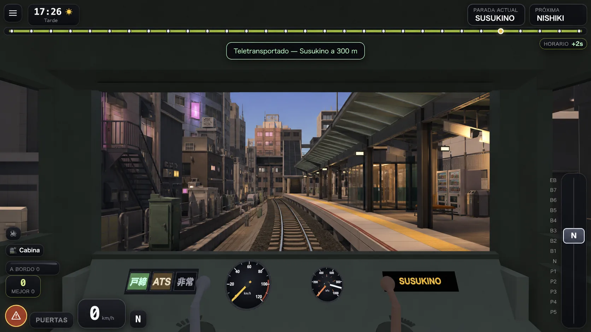
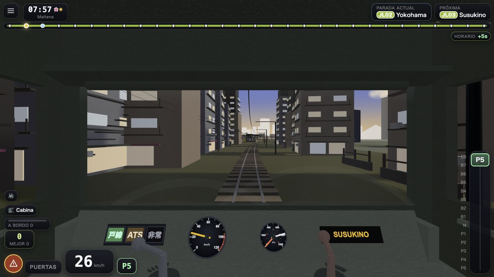
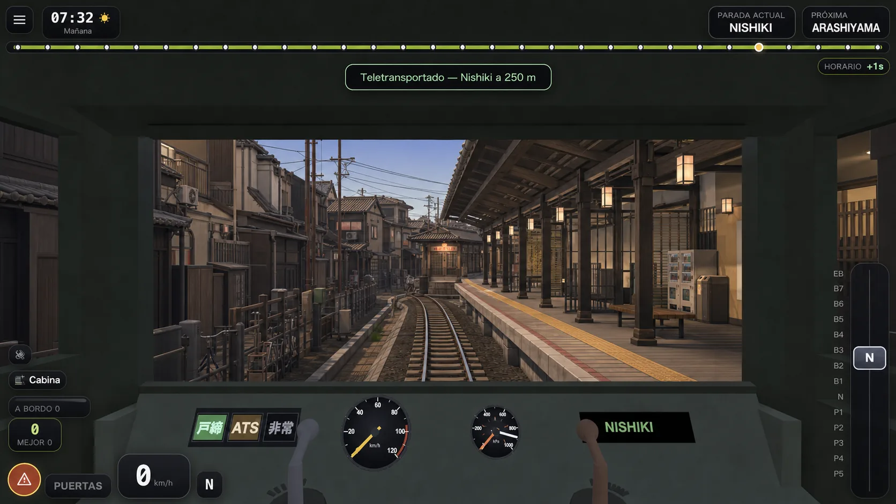
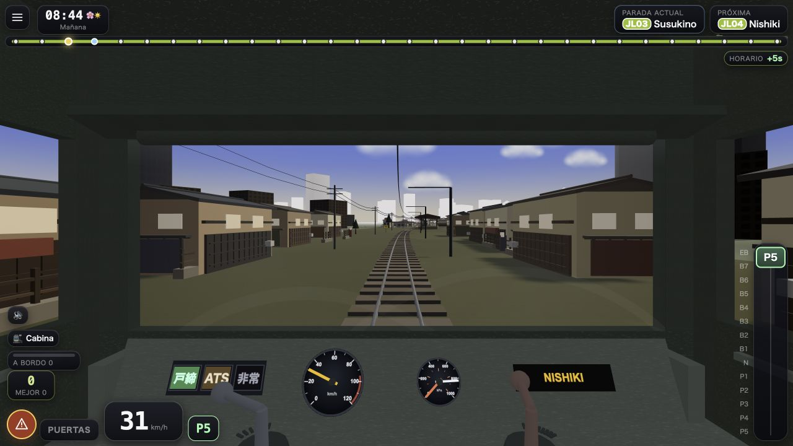

# Japan Loop 0.2.1 — vertical gráfica Susukino → Nishiki

Fecha de cierre: 2026-07-30.

Este documento es el traspaso autoritativo del salto gráfico de 0.2.1. No
describe una promesa para las treinta estaciones: describe la **vertical
jugable terminada** que fija el método con el que se puede llevar el resto del
anillo a ese nivel sin improvisar assets ni hipotecar el móvil.

## 1. Qué problema resuelve

En 0.2.0 la base técnica era sólida, pero visualmente casi todas las estaciones
seguían siendo la misma losa/marquesina, la ciudad eran cubos escalados y los
pasajeros eran sprites planos incluso pegados a la ventanilla.

0.2.1 elige dos estaciones contiguas y opuestas:

- **Susukino**: estación urbana de acero, vidrio y luz; bloque denso de
  Sapporo, balcones, escaleras, equipos y comercio.
- **Nishiki**: estación baja de madera, cubierta `kirizuma`, aleros, rafters,
  shoji y una calle de machiya estrechas.

La prueba de dirección es sencilla: desde la cabina, sin leer el HUD y también
de día, debe saberse en pocos segundos cuál de las dos zonas se está
atravesando.

## 2. Referencias visuales: objetivo, no asset

Las referencias se generaron **a partir de capturas reales del juego**, con la
cabina y el encuadre fijados. No entran en el bundle y no son texturas del
mundo; viven en el repo para que la intención no se pierda entre chats.

### Susukino

Prompt normalizado y reproducible:

> Mantén exactamente la cámara de conductor, la cabina, la vía y el HUD de la
> captura. Rediseña solo el mundo como un objetivo alcanzable en Three.js
> móvil, low-poly premium: estación Susukino de 70 m en cinco crujías de 14 m,
> acero oscuro, vidrio, marquesina plegada, sala de espera y servicios; barrio
> denso de Sapporo con bloques medianos irregulares, balcones, escaleras de
> incendios, aire acondicionado, tendido y comercio. Paleta sobria con ámbar,
> magenta y cian. Sin personas, sin texto nuevo, sin geometría orgánica y sin
> aspecto de render fotorrealista imposible de reproducir en el juego.

### Nishiki

Prompt normalizado y reproducible:

> Mantén exactamente la cámara de conductor, la cabina, la vía y el HUD de la
> captura. Rediseña solo el mundo como un objetivo alcanzable en Three.js
> móvil, low-poly premium: estación Nishiki de 70 m en cinco crujías de 14 m,
> madera oscura, cubierta japonesa a dos aguas con alero ancho, rafters,
> faroles y cerramiento shoji; calle estrecha de machiya de Kioto, fachadas
> profundas, celosías, noren, equipos domésticos, cercas y cableado. Paleta de
> yeso cálido, madera, teja azul-gris y pequeñas luces ámbar. Sin personas, sin
> texto nuevo y sin complejidad orgánica.

Las dos referencias objetivo se conservan en WebP calidad 82, inspeccionadas
a tamaño original: pasan de 3,4 MB en PNG a 187 KB combinadas. Las capturas
`*-implemented` se mantienen en ~82 KB cada una.

### Decisión sobre `img2threejs`

No se convirtió ninguna de estas imágenes completa a 3D. Una escena
image-to-3D habría producido un diorama monolítico que después habría que:

1. separar de la vía y del andén existentes;
2. reescalar hasta los 70 m reales;
3. corregir colisiones, pivotes, terreno, materiales y LOD;
4. trocear/combinar otra vez para recuperar culling y draw calls.

Para arquitectura repetible era más rápido, más pequeño y más controlable
construir módulos duros directamente en el motor. `img2threejs` **no queda
descartado**: el próximo experimento válido es un único hero prop o edificio
aislado, sobre fondo limpio, sin personas/vegetación, con frente y 3/4 claros.
Debe entrar como GLB, pasar por decimado/meshopt, respetar ≤20k tri para héroe
o ≤2k para prop repetible y compararse contra el módulo procedimental.

## 3. Arquitectura estática — `ArtPass021`

Fichero: `src/game/ArtPass021.ts`.

`GeometryBatch` toma cajas/cilindros unitarios, hornea su transformación y
color de vértice, y fusiona por material. El detalle se autoriza al construir,
pero **no se paga una llamada de dibujo por detalle**.

Resultado real post-merge:

| parte | mallas/draws de diseño | triángulos |
|---|---:|---:|
| Dos estaciones + dos barrios, día | 10 | 49.128 |
| Invierno (dos capas de nieve adicionales) | 12 | 49.128 |
| Presupuesto duro | 10 / 12 | 50.000 |

La escena termina en doce mallas: opaco/vidrio/luz/nieve por estación y
opaco/luz por barrio. Todas llevan `tagGroup('art021-*')`.

Decisiones que importan:

- Las estaciones codifican **cinco crujías de 14 m**; no se escaló una
  maqueta pequeña para fingir 70 m.
- `PLATFORM_GEOM` en `City.ts` es la única fuente de `inner`, `outer` y
  `len`: estación procedural, vertical autoral y los dos LOD de pasajeros
  consumen esas mismas cotas. No se redeclaran 3/14/70.
- Los barrios cercanos están a 15–23 m de vía; el skyline genérico se empuja
  a 54–96 m y vuelve a ser fondo.
- En el tramo Susukino→Nishiki el skyline entrega su tier a `shitamachi` antes
  de llegar: los rascacielos de 130 m ya no aterrizan en el mercado.
- La fachada que mira a vía es `side * width/2`. Un signo invertido escondió
  balcones/celosías en la pared trasera durante la primera revisión; queda
  explicado junto al cálculo para que no vuelva.
- Las filas authored terminan antes del volumen de 70 m de estación. Llegar
  hasta `t≈0.98` metía un edificio alrededor de la cámara CCTV fija.
- Las salas de espera se desplazaron fuera de la diagonal de esa cámara. Las
  tres vistas (cabina, exterior, andén) son parte del contrato visual.
- Todo apoyo usa `groundHeightAt`; no hay nuevas Y absolutas.
- El barrio **recibe** sombras pero no vuelve a dibujar miles de barras
  subpíxel en el pase de sombras. Las estaciones sí proyectan: la marquesina
  debe sombrear su propio andén.
- Las superficies emisivas se limitan para conservar ámbar/cian/magenta bajo
  tone mapping; a 1,6 de intensidad se recortaban todas a blanco.
- La estación procedural **no se borra entera** bajo Susukino/Nishiki:
  aporta la losa, franjas, señales, lámparas y mobiliario compartidos. Su
  cubierta plana se conserva deliberadamente como respaldo opaco bajo los
  pliegues autorales: las superficies se cruzan, pero no son coplanares, así
  que no hay z-fighting; en invierno su recolor blanco además evita rendijas
  oscuras entre placas de nieve. Es sustrato medido, no geometría olvidada.

La malla estática cambió deliberadamente y por eso se re-capturaron las cuatro
referencias canónicas:

| estación del año | semántico | estructural |
|---|---|---|
| primavera | `3d7118d1` | `490ad6bf` |
| verano | `cfd7949a` | `8f127d66` |
| otoño | `0c78532f` | `927deefa` |
| invierno | `61da4b27` | `b6e46a69` |

### Reproducción independiente de esas ocho referencias

No se recorren estaciones: se digiere **el mundo completo** cuatro veces, en
orden `spring → summer → autumn → winter`, y al terminar se restaura
`spring`. Procedimiento literal:

1. Cierra servidores anteriores y ejecuta
   `npm run dev -- --host 127.0.0.1 --port 5173 --strictPort`.
2. En ese origen, borra datos previos una vez con
   `localStorage.clear(); sessionStorage.clear()` y cierra la pestaña.
3. Abre exactamente
   `http://127.0.0.1:5173/?canon&checkWorld`.
4. Espera a que `<html data-world-check>` contenga cuatro resultados y copia
   **los valores calculados** de `semantic`/`structural`, no el veredicto.
5. Recarga la misma URL: los ocho valores deben repetirse y todos los
   `semanticOk`/`structuralOk` deben ser `true`.

La captura original de 0.2.1 se hizo en un perfil ya usado, no en uno vacío;
`?canon` ignoró las cuatro preferencias relevantes: semilla, estación del
año, clima y frentes automáticos. El navegador integrado no estuvo
disponible durante esta corrección para afirmar una segunda captura limpia:
el procedimiento anterior queda como reproducción independiente pendiente,
no como prueba ya ejecutada. Otros estados guardados — cámara, tutoriales,
audio o récord— son dinámicos y no entran en el fingerprint.

## 4. Pasajeros híbridos — volumen cerca, sprite lejos

Ficheros: `src/game/HybridPassengers021.ts`, integración en
`src/game/Passengers.ts`.

No se añadió una multitud decorativa encima de la jugable:

- se seleccionan doce slots reales + el attendant de Susukino y Nishiki;
- el atributo `aModel` oculta su billboard cuando entra el 3D;
- el 3D lee los mismos `aOffset`, modo, fila, fase y escala que el sistema de
  embarque; caminar, ocultarse, apuntar y hacer reverencia siguen la partida;
- cuando sale del LOD, `aModel` vuelve a cero y reaparece **ese mismo**
  pasajero como sprite.

El kit tiene torso, cabeza, pelo, brazos, piernas y un pool de accesorios.
Bolso, dos ojos, dos zapatos y el paraguas plegado de dos piezas comparten ese
último pool: más lectura sin una séptima llamada. En lluvia o nieve, el mismo
arquetipo conserva el mismo color de paraguas al cruzar el umbral de LOD;
quien deliberadamente no lo llevaba como sprite tampoco lo recibe en 3D.
Nueve combinaciones de cuerpo/abrigo/pelo rompen el maniquí único.

Contrato móvil:

| concepto | valor |
|---|---:|
| Figuras cubiertas | 26 |
| Distancia de modelo | 108 unidades |
| Draws dentro del LOD | 6 |
| Capacidad máxima | 9.256 tri |
| Una estación típica (13 figuras) | 4.628 tri |
| A 300 m | 0 draws 3D; sprites originales |

Las matrices activas se reempaquetan al principio de cada pool y `count` baja
a 0/13/26. La decisión de LOD es pura (`art021ModelMask`) y tiene prueba de
frontera. No hay arrays/mapas por frame. Los seis pools no proyectan sombras:
conservan la sombra de contacto existente de los sprites.

El grupo entero lleva `userData.dynamic`: los pasajeros nunca contaminan los
hashes del mundo estático.

## 5. Coste medido contra 0.2.0

Comparación estructural hecha el 2026-07-30 contra el commit `7935f9a`, en un
worktree separado, misma máquina/navegador, `?canon`, cámara de cabina, tren
quieto a 300 m y pase de sombras activo. A esa distancia el 3D está apagado,
así que la tabla mide arquitectura, no muñecos.

| destino | 0.2.0 | 0.2.1 | diferencia |
|---|---:|---:|---:|
| Susukino — draws | 200 | 211 | +11 (+5,5 %) |
| Susukino — tri | 670.436 | 720.044 | +49.608 (+7,4 %) |
| Nishiki — draws | 200 | 207 | +7 (+3,5 %) |
| Nishiki — tri | 668.708 | 687.916 | +19.208 (+2,9 %) |

La primera integración daba 218/746.828 en Susukino. Dos cambios recuperaron
7 draws y 26.784 tri en ese mismo encuadre:

1. LOD híbrido: 0 modelos a 300 m, sprites otra vez.
2. Sin sombras proyectadas por el detalle del barrio; solo la estación.

Esto **no es una medición de fps de iPhone**. Cuenta carga enviada al renderer
y demuestra que el salto está acotado; WebKit/driver/térmica se validan en el
dispositivo. La tanda pendiente debe conducir Susukino→Nishiki en
primavera/despejado y repetir invierno/nieve/noche. Si hay caída sostenida, se
ajusta primero 108 m y el pase de sombras, no se degrada la silueta.

## 6. Contratos y diagnóstico

- `src/game/art021Contract.ts`: presupuestos puros y distancia de LOD.
- `test/art021Contract.test.ts`: rompe por draw/tri/figuras y prueba 0/1/2/3
  estaciones activas en la frontera del LOD.
- Los builders validan sus **informes reales post-merge** al arrancar; el test
  no construye una escena falsa y pretende medirla. Una infracción lanza en
  desarrollo; producción escribe `console.error` y conserva la escena
  jugable, porque un exceso de presupuesto no justifica una pantalla blanca.
- En dev, `<html data-art021>` expone esos dos informes reales.
- En dev, `<html data-render-info>` actualiza cada 500 ms el último frame
  (estación/cámara/draws/tri/lines/points/sombra). No existe en producción.
- El flujo `art021-backdrop` evita que los offsets de composición consuman
  sorteos de `city`; Susukino/Nishiki no rebarajan por accidente el resto.

Verificación ejecutada al cerrar:

- `npm test`: 47/47.
- TypeScript estricto: limpio.
- `npm run build` de Vite: limpio antes y después del commit.
- `?canon&checkWorld`: 4/4 semántico y estructural.
- cámara CCTV de las dos estaciones: despejada.
- PWA 0.2.1: `dist/sw.js` válido, lista de bundles precacheados comprobada,
  CI con test+build verde, worker y bundle final descargados de Pages, y
  producción abierta/iniciada hasta Nishiki.

No se verificó:

- iPhone o Android físicos;
- fps sostenidos, temperatura o memoria en WebKit móvil;
- PerfLog de invierno+nieve+noche con esta geometría;
- funcionamiento offline en un dispositivo móvil tras matar la PWA.

## 7. Qué NO se debe interpretar

- No están “arregladas las treinta estaciones”. Está probado el **sistema**
  con una pareja contigua y suficientemente distinta.
- Las referencias generadas no son una promesa de fotorealismo ni deben
  importarse como diorama.
- 49k tri no es presupuesto por estación: es el total de dos estaciones y
  dos barrios, ya fusionado.
- Un `renderMs` bajo en iPhone no exonera a la GPU diferida; se mantiene la
  lectura de PerfLog v5 documentada en el ciclo anterior.

## 8. Propuesta de extensión — NO es la hoja de ruta firmada

Lo siguiente es una propuesta técnica, subordinada a los cuatro pendientes
que el panel dejó firmados. Van **antes** de extraer kits o abrir una tercera
familia:

1. tanda A/B de sectorización con cielo despejado y mediodía;
2. PerfLog de invierno+nieve+noche, repetido con la geometría 0.2.1;
3. cerrar la fracción de vía como fuente común de los sistemas por zona;
4. audio por zonas consumiendo `zoneUrbanity`.

Solo después:

1. extraer `StationKit`/`DistrictKit` desde esta vertical, sin copiar
   `ArtPass021` treinta veces;
2. aplicar primero a una estación `green/bay` para probar una tercera familia;
3. encargar/generar solo hero props que el kit de primitivas no resuelva;
4. usar image-to-3D en un asset aislado y comparar su GLB optimizado contra el
   módulo procedural antes de adoptar ese pipeline;
5. extender el LOD híbrido a otras estaciones solo donde la cámara llegue a
   ver personas a tamaño suficiente.
